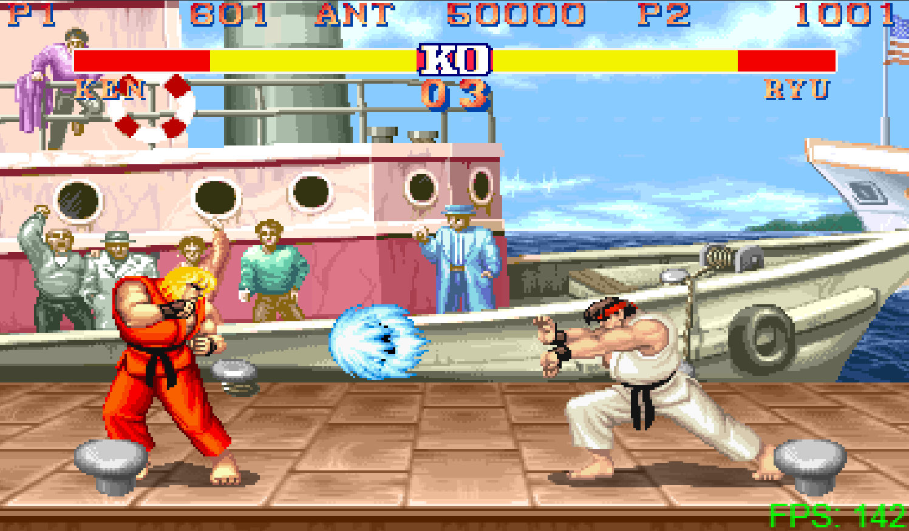

# Street Fighter 2 JS Clone

This is a browser-based 2D fighting game inspired by Street Fighter II. The game is built entirely using **vanilla JavaScript**, **HTML**, and **CSS**, and features a custom engine with modular architecture and OOP patterns.

---

## 🕹️ Features

- ✅ Two playable characters: **Ryu** and **Ken**
- ✅ Controller & keyboard support
- ✅ Fully animated basic attacks:
  - Light, Medium, and Heavy Punch
  - Light, Medium, and Heavy Kick
- ✅ Jumping (vertical and diagonal)
- ✅ Crouching
- ✅ Animated **Hadouken** special move (input-based)
- ✅ Camera system with sliding stage
- ✅ Depth illusion with animated background
- ✅ UI with animated health bars
- ✅ Proper hitboxes & hurtboxes system
- ✅ Well-organized modular code (OOP with classes/modules)

---

## 🔧 How to Run

Due to browser CORS policies, **you must use a local server** to run the game properly.

 - You can use Live Server if using VS Code.
 - Just click the black screen after the server is running.

---

## 🧠 Project Structure

- `src/` – All source code lives here
  - `engine/`, `constants/`, `utils/` – Core engine logic
  - `entities/fighters/` – Character classes & animations
  - `stage/` – Stage logic and rendering
  - `overlays/`, `scenes/` – UI and game states
- `index.html` – Entry point

---

## 🎮 Customization

### 🔧 Change Key Bindings  
You can update keyboard or controller mappings by editing:

**File:** `src/config/controls.js`  
Search for `Player 1` or `Player 2` to locate their respective bindings.  
Modify keys or buttons as needed to match your preferences.

### 🟥 Toggle Hitbox Debug Mode  
To display hitboxes for debugging purposes:

**File:** `src/constants/game.js`  
Set the `ENABLE_DEBUG` constant to `true`:

## 🚧 TODO

Planned features:

- Add blocking
- Add crouching attacks
- More special moves
- Game start / end overlays (e.g. "FIGHT", "KO")
- Game state: Victory/Defeat screens
- Intro screen with character selection
- Settings page for bindings, volume, etc.
- Add more fighters
- Responsive design and polish

---

## 📸 Screenshots

---

## 💡 Credits

Sprites, SFX & sounds adapted from original Street Fighter II assets.  
This project is built for educational purposes.

---

## 📜 License

MIT – feel free to use or modify with credit.

## 🤝 Collaborations

This project is open to collaboration!

If you're interested in contributing (bug fixes, features, animations, or anything creative), feel free to fork the repository, open a pull request, or reach out directly.